# Travel Tracker - Projektdokumentation

## Inhaltsverzeichnis

1. [Ausgangslage](#1-ausgangslage)
2. [Lösungsidee](#2-lösungsidee)
3. [Vorgehen & Artefakte](#3-vorgehen--artefakte)
    1. [Understand & Define](#31-understand--define)
    2. [Sketch](#32-sketch)
    3. [Decide](#33-decide)
    4. [Prototype](#34-prototype)
    5. [Validate](#35-validate)
4. [Erweiterungen](#4-erweiterungen)
5. [Projektorganisation](#5-projektorganisation)
6. [KI-Deklaration](#6-ki-deklaration)
7. [Anhang](#7-anhang)

## 1. Ausgangslage

Viele Personen möchten ihre Reisen festhalten, später wiederfinden und visuell sehen, welche Länder sie bereits besucht haben. Eine reine Liste von Reisen ist dafür zwar funktional, aber wenig anschaulich. Der Travel Tracker kombiniert deshalb eine persönliche Reiseliste mit einer interaktiven Weltkarte und einer Fotogalerie pro Reise.

- **Problem:** Besuche, Orte, Notizen und Fotos sind oft über verschiedene Apps oder Dateien verteilt. Dadurch ist schwer erkennbar, welche Länder bereits bereist wurden und welche Erinnerungen zu welcher Reise gehören.
- **Ziele:**
  - Benutzer können sich registrieren und anmelden.
  - Benutzer können eigene Reisen erfassen, bearbeiten und löschen.
  - Besuchte Länder werden auf einer interaktiven Weltkarte markiert.
  - Länder können über die Karte oder über eine Suche ausgewählt werden.
  - Pro Reise können Fotos direkt in MongoDB gespeichert und in einer Galerie angezeigt werden.
- **Primäre Zielgruppe:** Privatpersonen, die ihre Reisen strukturiert und visuell dokumentieren möchten.
- **Weitere Stakeholder:** Manager, die Auslandsreisen ihrer Mitarbeiter tracken möchten, oder Reiseblogger, die ihre Erlebnisse teilen wollen (Sharing aktuell nicht geplant, könnte aber eine Erweiterung sein).

## 2. Lösungsidee

Die Anwendung ist eine SvelteKit-Webapplikation mit MongoDB als Datenbank. Nach dem Login gelangt der Benutzer auf ein Dashboard mit Länder-Suche und Weltkarte.

- **Kernfunktionalität Beschreibung:**
  - Registrierung, Login und Logout mit Session-Cookie.
  - Dashboard mit Weltkarte, den besuchten Ländern und scrollbarer Reiseliste.
  - Länder-Suche oberhalb der Karte.
  - Neue Reise erfassen mit Land, Ort, Datum, Notizen und optionalen Fotos.
  - Reise bearbeiten oder löschen.
  - Fotogalerie mit Grid-Ansicht und fullscreen Slideshow/Lightbox.
- **Kernfunktionalität Workflows:**
  - Workflow 1: Login/Registrierung
  
    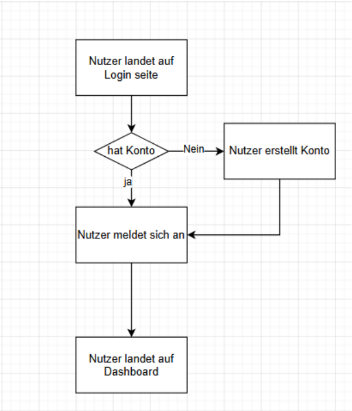
  - Workflow 2: Reise hinzufügen
  
    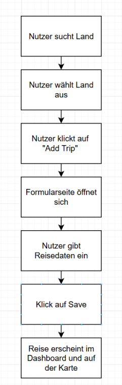
  - Workflow 3: Reise bearbeiten
  
    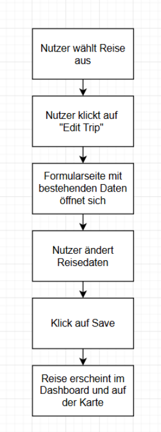
  - Workflow 4: Reise löschen
  
    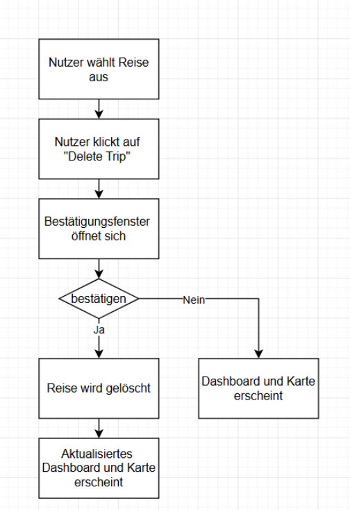
- **Annahmen:**
  - Eine Reise gehört immer genau einem eingeloggten Benutzer.
  - Pro Reise sind maximal 10 Galerie-Fotos vorgesehen.
  - Fotos werden direkt als Base64-Daten im bestehenden Trip-Dokument gespeichert, damit kein externer Bildhost benötigt wird.
- **Abgrenzung:**
  - Es gibt keine öffentliche Teilen-Funktion.
  - Es gibt keine komplexe Routenplanung oder Karten-Navigation.
  - Die App ist ein Prototyp und keine produktionsfertige Plattform mit Rollen-/Rechteverwaltung.

## 3. Vorgehen & Artefakte

Die Umsetzung erfolgte iterativ: zuerst Authentifizierung und Basis-Dashboard, danach Trip-Verwaltung, Länder-Auswahl, Fotoverwaltung und Layout-Verbesserungen.

### 3.1 Understand & Define

#### Zielgruppenverständnis

##### Problemraumanalyse

Viele Menschen reisen regelmässig und möchten ihre besuchten Länder, Städte und Erlebnisse festhalten. Oft werden Erinnerungen jedoch nur über Fotos, Social Media oder einzelne Notizen gespeichert. Dadurch entstehen mehrere Probleme:

- Reiseinformationen sind auf verschiedene Plattformen verteilt
- Bereits besuchte Länder geraten mit der Zeit in Vergessenheit
- Es fehlt eine klare Übersicht über vergangene Reisen
- Wunschdestinationen werden häufig ungeordnet gespeichert
- Bestehende Lösungen fokussieren oft auf Social Media oder Buchungen statt auf persönliche Reiseverwaltung

Zusätzlich besteht bei vielen Nutzern der Wunsch, Reiseziele visuell darzustellen und persönliche Fortschritte sichtbar zu machen.

---

##### Recherche

Zur Analyse bestehender Lösungen wurden verschiedene Reiseplattformen betrachtet:

**Polarsteps**  
Fokus auf laufendes Reise-Tracking und Teilen mit Freunden.

**Google Maps Listen**  
Möglichkeit Orte zu speichern, jedoch wenig persönliche Statistik oder Verwaltung.

**Tripadvisor**  
Schwerpunkt auf Bewertungen und Empfehlungen.

**Instagram / Fotoalben**  
Gut für Erinnerungen, aber keine strukturierte Organisation von Reisen.

Die Recherche zeigte, dass viele bestehende Plattformen entweder sehr komplex oder stark auf Social Features ausgerichtet sind. Eine einfache Plattform zur persönlichen Verwaltung und Visualisierung bereits besuchter Länder bietet deshalb Potenzial.

---

##### Proto-Personas

**Persona 1 – Lukas Schneider**

**Persönliche Attribute**
- 24 Jahre alt
- Student
- reist gerne mit Freunden
- plant mehrere Städtereisen pro Jahr

**Umfeld („Kontext“)**
- Nutzt viele digitale Apps
- Speichert Reiseideen oft ungeordnet
- Verwendet Fotos und Social Media als Erinnerung

**Ziele**
- Überblick über besuchte Länder behalten
- Neue Reiseziele planen
- Reisen visuell auf einer Karte sehen

**Aufgaben**
- Reisen hinzufügen
- Länder suchen
- Reiseinformationen bearbeiten

**Frustpunkte**
- Informationen sind auf viele Plattformen verteilt
- Vergisst bereits besuchte Orte
- Keine zentrale Übersicht

---

**Persona 2 – Sandra Meier**

**Persönliche Attribute**
- 38 Jahre alt
- berufstätig
- reist mehrmals jährlich mit der Familie

**Umfeld („Kontext“)**
- Wenig Zeit für Organisation
- Viele Fotos und Erinnerungen vorhanden
- Nutzt Apps hauptsächlich für praktische Funktionen

**Ziele**
- Familienreisen dokumentieren
- Reisen einfach verwalten
- Erinnerungen langfristig speichern

**Aufgaben**
- Reisedaten erfassen
- Reisen bearbeiten oder löschen
- Reisehistorie durchsuchen

**Frustpunkte**
- Fotos alleine geben keine Übersicht
- Frühere Reisen sind schwer auffindbar
- Reiseinformationen gehen verloren

---

#### Wesentliche Erkenntnisse

- Nutzer wünschen sich eine zentrale Plattform für Reiseverwaltung
- Eine visuelle Darstellung über eine Weltkarte erhöht die Übersichtlichkeit
- Einfache CRUD-Funktionen (hinzufügen, bearbeiten, löschen) sind zentral
- Nutzer bevorzugen klare und einfache Benutzeroberflächen
- Reiseinformationen sollen schnell auffindbar sein
- Bestehende Plattformen sind oft zu komplex oder zu stark auf Social Media fokussiert
- Die Kombination aus Karte, Suche und Reiseübersicht bietet einen hohen Mehrwert
- Besonders wichtig sind Übersicht, Einfachheit und schnelle Bedienung

### 3.2 Sketch

#### Variantenüberblick

In der Sketch-Phase wurden mithilfe der Methode **Crazy 8s** verschiedene mögliche Benutzeroberflächen für die TravelTracker-App entwickelt. Ziel war es, in kurzer Zeit unterschiedliche Ansätze zur Darstellung und Verwaltung von Reisedestinationen zu skizzieren.

Dabei entstanden verschiedene Ideen für:

- Listenansichten
- Kategorisierte Länderansichten
- Kartenbasierte Darstellungen
- Such- und Filterfunktionen
- Grid-Layouts
- Kombinationen aus Karte und Reiseinformationen

Die unterschiedlichen Varianten halfen dabei, verschiedene Möglichkeiten zur Navigation, Informationsdarstellung und Benutzerführung zu vergleichen.

---

#### Crazy 8s

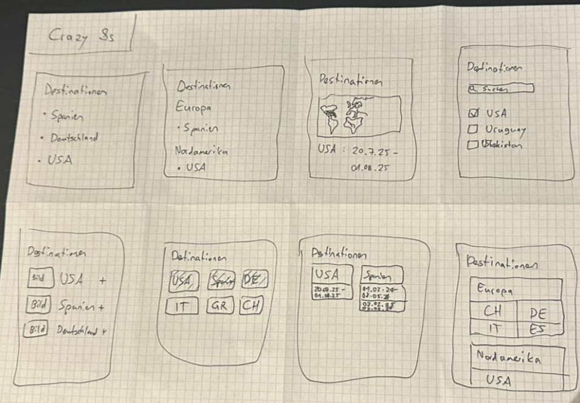

Im Crazy-8s-Prozess wurden acht unterschiedliche Layout-Ideen erstellt. Die Varianten unterschieden sich hauptsächlich in der Darstellung der Reiseinformationen und der Strukturierung der Inhalte.

Wichtige Unterschiede zwischen den Varianten:

- Einige Varianten fokussierten sich auf einfache Listenansichten
- Andere konzentrierten sich auf geografische Gruppierungen nach Kontinenten
- Mehrere Skizzen verwendeten eine visuelle Weltkarte als zentrales Element
- Teilweise wurden Länder als Karten/Grid dargestellt
- Einige Varianten integrierten Such- und Filterfunktionen
- Andere fokussierten stärker auf Reisedaten und Zeiträume

Während der Ideensammlung zeigte sich schnell, dass besonders die Kombination aus Weltkarte, Suchfunktion und Reiseübersicht einen hohen Mehrwert bietet.

---


### 3.3 Decide

#### Gewählte Variante & Begründung

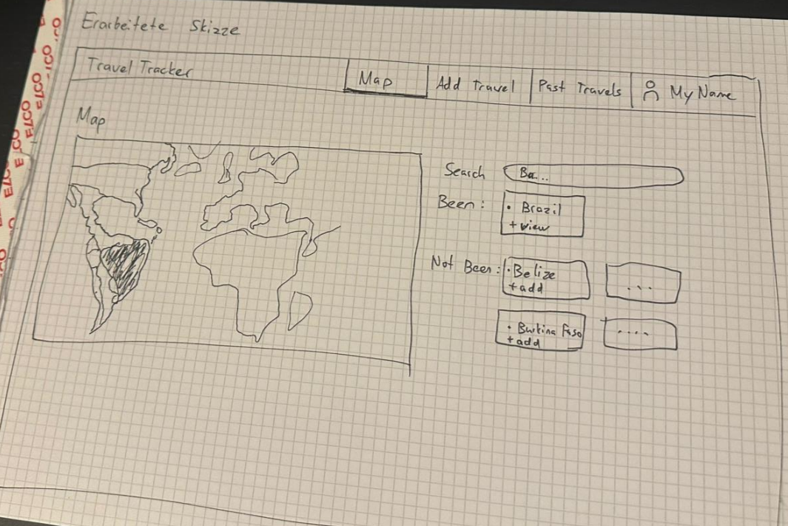

Basierend auf den Erkenntnissen aus den Crazy 8s und dem Feedback von Tyler Storz wurde anschliessend eine detailliertere Hauptskizze erstellt.

Die finale Skizze kombiniert:

- Eine grosse Weltkarte als visuelles Hauptelement
- Eine Suchfunktion für Länder
- Bereiche für bereits besuchte und noch nicht besuchte Länder
- Eine klare Navigation mit mehreren Pages
- Direkte Aktionen wie „add“ oder „view“

Die Navigation wurde bewusst einfach gehalten, damit Nutzer schnell zwischen den wichtigsten Bereichen wechseln können.

Zusätzlich wurde darauf geachtet, dass:

- Die wichtigsten Funktionen direkt sichtbar sind
- Die Karte genügend Platz erhält
- Reiseinformationen übersichtlich dargestellt werden
- Die Benutzeroberfläche klar und intuitiv wirkt

Die ausgearbeitete Skizze diente später als Grundlage für die digitalen Mockups in Figma.

---

#### End-to-End-Ablauf:
  1. Benutzer registriert sich oder meldet sich an.
  2. Dashboard lädt alle eigenen Reisen aus MongoDB.
  3. Besuchte Länder werden auf der Weltkarte eingefärbt.
  4. Benutzer wählt ein Land über Karte oder Suche.
  5. Die Reiseliste wird nach diesem Land gefiltert.
  6. Benutzer erfasst, bearbeitet oder löscht Reisen.
  7. Fotos werden im Edit-/New-Formular hinzugefügt und später in Galerie/Slideshow angezeigt.

##### User Journey Map

| Schritt | Aktion des Benutzers                              | Systemreaktion                                                   |
|---------|---------------------------------------------------|------------------------------------------------------------------|
| 1       | Benutzer registriert sich oder meldet sich an     | Benutzerkonto wird erstellt bzw. Benutzer wird authentifiziert   |
| 2       | Benutzer öffnet das Dashboard                     | Alle gespeicherten Reisen werden aus MongoDB geladen             |
| 3       | Benutzer sieht die Weltkarte                      | Bereits besuchte Länder werden farblich markiert                 |
| 4       | Benutzer sucht ein Land oder klickt auf die Karte | Die Reiseliste wird entsprechend gefiltert                       |
| 5       | Benutzer öffnet eine bestehende Reise             | Reisedetails und Fotos werden angezeigt                          |
| 6       | Benutzer erstellt eine neue Reise                 | Formular für Land, Stadt, Datum, Notizen und Fotos wird geöffnet |
| 7       | Benutzer speichert die Reise                      | Daten werden in MongoDB gespeichert und die Karte aktualisiert   |
| 8       | Benutzer bearbeitet oder löscht eine Reise        | Änderungen werden direkt übernommen                              |
| 9       | Benutzer betrachtet Fotos in der Galerie          | Bilder werden als Galerie oder Slideshow angezeigt               |
---

### 3.3 Mockup

#### Figma-Prototyp

Der klickbare Prototyp wurde mit Figma erstellt und diente als Grundlage für die spätere Implementierung des Projekts.

**Figma URL:**  
https://www.figma.com/proto/j2t9e8nlolphKobL1eoeFj/Travel-Tracker?node-id=0-1&t=tnjlZKxY6jMUvOeC-1

---

#### Designentscheide

##### Plattformwahl: Desktop First

Ich habe mich bewusst für eine Desktop-Version entschieden, da die Anwendung mehrere Informationen gleichzeitig anzeigen soll, beispielsweise:

- Suchbereich
- Resultatliste
- Weltkarte
- Navigation

Dadurch kann der verfügbare Platz optimal genutzt werden. Eine mobile Version wäre später als Erweiterung möglich.

---

##### Navigation

Die Navigation befindet sich oben rechts und wurde bewusst einfach gehalten.

Sie besteht aus folgenden Bereichen:

- Dashboard
- Add Trip
- My Profile

Dadurch können Nutzer schnell zwischen den wichtigsten Funktionen wechseln.

---

##### Layout

Das Dashboard ist in zwei Hauptbereiche unterteilt.

**Linke Seite**
- Suchfunktion für Länder
- Resultatliste
- Trip-Karten mit Reiseinformationen
- Button „Add Trip“

**Rechte Seite**
- Interaktive Weltkarte

Diese Aufteilung ermöglicht eine klare Trennung zwischen Datenverwaltung und visueller Übersicht.

---

##### Farbwahl / Stil

Das Design wurde bewusst schlicht, modern und neutral gehalten, damit die Funktionalität im Vordergrund steht.

Verwendet wurden:
- Helle Hintergründe
- Dunkle Buttons für wichtige Aktionen
- Rote Buttons für Löschen- oder Warnaktionen
- Einfache und klare Formularelemente

---

##### Benutzerfreundlichkeit

Wichtige Aktionen wie Hinzufügen, Bearbeiten und Löschen sind direkt sichtbar und einfach erreichbar.

Die Formulare wurden bewusst einfach aufgebaut und enthalten:
- Land
- Stadt
- Datum von / bis
- Notizen
- Fotos

Dadurch soll eine möglichst intuitive Bedienung ermöglicht werden.

---

##### Anmerkungen

Obwohl ich bewusst ein schlichtes Design gewählt habe, hatte ich während der Arbeit mit Figma teilweise Mühe, das gewünschte visuelle Design genau umzusetzen. Der Fokus lag deshalb primär auf Struktur, Benutzerführung und Funktionalität des Mockups.

Für die finale Umsetzung der App wurden weitere visuelle Verbesserungen umgesetzt, damit die Anwendung moderner und lebendiger wirkt.

---

#### Screenshots des Mockups

##### Login Screen

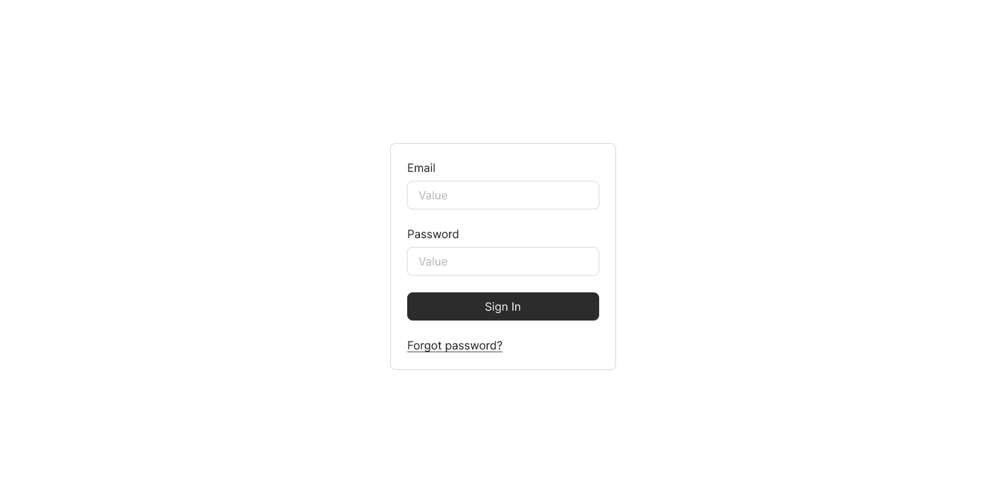

Der Login-Screen ermöglicht Benutzern die Anmeldung zur Anwendung. Das Layout wurde bewusst minimalistisch gehalten.

---

##### Dashboard / Weltkarte

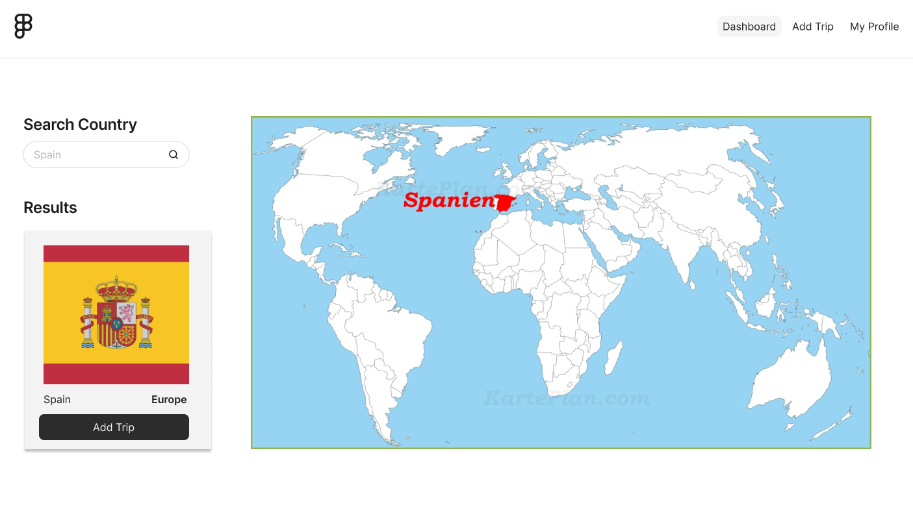

Das Dashboard kombiniert die Reiseverwaltung mit einer visuellen Weltkarte. Bereits besuchte Länder werden hervorgehoben.

---

##### Add Trip Formular

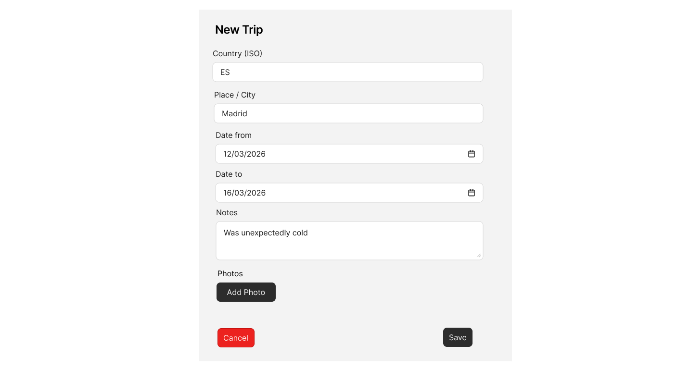

Über das Formular können neue Reisen mit Land, Stadt, Datum, Notizen und Fotos hinzugefügt werden.

---

##### Edit Trip Formular

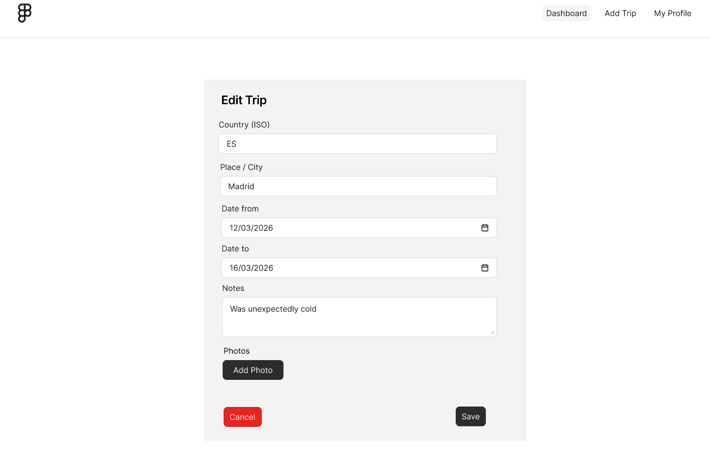

Bestehende Reisen können bearbeitet und aktualisiert werden.

---

##### Delete Confirmation Dialog

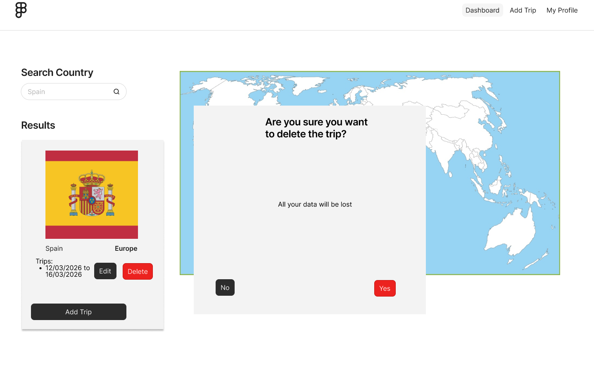

Vor dem Löschen einer Reise erscheint ein Bestätigungsdialog, um versehentliche Löschungen zu vermeiden.

### 3.4 Prototype

#### 3.4.1. Entwurf (Design)
Beschreibt die Gestaltung und Interaktion.
> **Hinweis:** Hier wird der **Prototyp** beschrieben, nicht das **Mockup**.

- **Informationsarchitektur:**
  - Der Prototyp ist als geschüzte Travel-Tracker-Webapplikation aufgebaut. Nicht eingeloggte Benutzer bewegen sich nur zwischen Login und Registrierung. Nach erfolgreicher Anmeldung führt der Hauptfluss direkt ins Dashboard.
  - Die globale Navigation liegt im Sticky Header. Nicht eingeloggte Benutzer sehen `Log in` und `Create account`; eingeloggte Benutzer sehen `Add Trip`, `Dashboard`, `Log out` sowie den aktuellen Benutzernamen mit Initialen-Avatar.
  - Die Hauptbereiche aus Nutzersicht:
    - **Login:** Anmeldung mit Benutzername und Passwort.
    - **Registrierung:** neues Benutzerkonto mit Benutzername und Passwort erstellen; danach automatische Anmeldung.
    - **Dashboard:** zentrale Arbeitsansicht mit Reiseübersicht, Filterstatus, scrollbarer Trip-Liste, Ländersuche, interaktiver Weltkarte, Galerie-Modal und Löschdialog.
    - **Add Trip:** Formular zum Erfassen einer neuen Reise mit Land, Ort/Stadt, Startdatum, optionalem Enddatum, Notizen und optionalen Fotos.
    - **Edit Trip:** Formular zum Bearbeiten einer bestehenden Reise inklusive bestehender Fotos, neuen Fotos und Entfernen/Undo von Fotos.
    - **Logout:** beendet die Session und entfernt das Session-Cookie.
  - Der wichtigste End-to-End-Flow im Prototyp ist: registrieren oder einloggen, Dashboard öffnen, Land über Karte oder Suche auswählen, Trip erfassen, Trip in der Liste sehen, Galerie öffnen, Trip bearbeiten oder löschen.

- **User Interface Design:**
  - **Login / Registrierung:** Beide Auth-Screens verwenden ein schmales zentriertes Panel mit klaren Formularfeldern. Die primäre Aktion ist jeweils als dunkler Primary Button gestaltet, die alternative Navigation als Secondary Button.
    - Login Screen:
      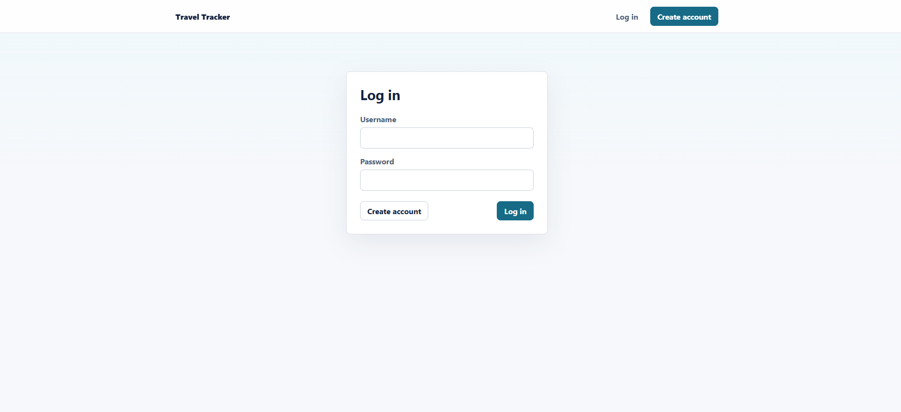
    - Registrierungsscreen:
      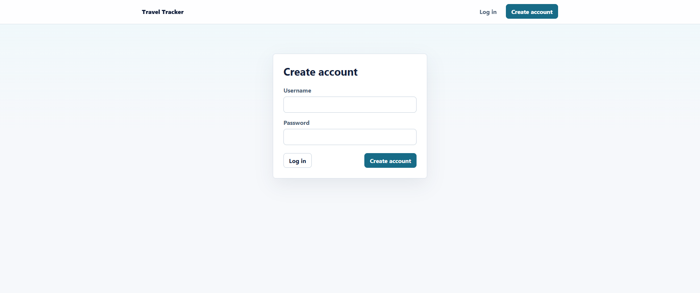
  - **Dashboard:** Die Ansicht ist zweispaltig aufgebaut. Links befindet sich ein fest hohes Overview-Panel mit Titel, Anzahl gespeicherter Reisen, optionalem aktivem Länderfilter und scrollbarer Trip-Liste. Rechts stehen oben die Ländersuche und darunter die Weltkarte.
    - 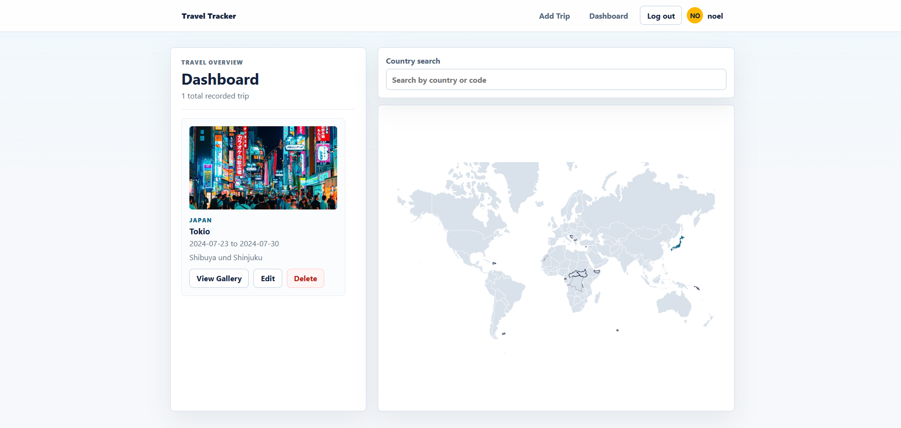
  - **Trip Cards:** Jede Reise wird als Karte mit Land, Ort/Stadt, Datumsspanne und optionalen Notizen angezeigt. Wenn Fotos vorhanden sind, wird das erste Foto als 16:9-Vorschau angezeigt und ein `View Gallery`-Button eingeblendet. Weitere Aktionen sind `Edit` und `Delete`.
    - Trip card ohne Foto
      
      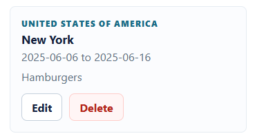
    - Trip card mit Foto

      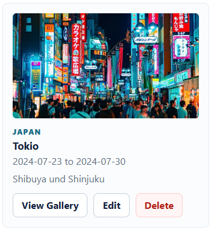
      
  - **Ländersuche und Karte:** Die Suche zeigt maximal acht Treffer nach Ländername oder ISO-Code. Die Weltkarte markiert besuchte Länder dunkelblau, das aktuell selektierte Land gelb und Hover-/Focus-Zustaende hellblau. Ein Klick oder Tastaturauswahl auf ein Land filtert die Trip-Liste.
    - Gefiltert nach "Br" mit Brasilien bereits ausgewählt:
     
      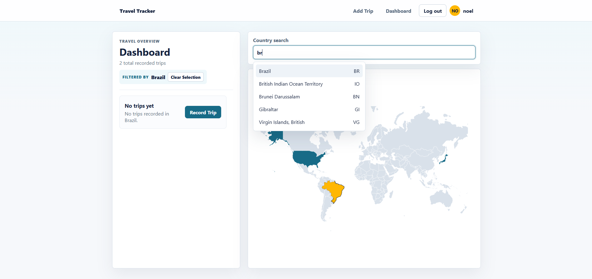
  - **Add/Edit Formulare:** Die Formulare nutzen ein zweispaltiges Grid für Land, Ort/Stadt und Datum, darunter Notizen und Fotoverwaltung. Der Country Picker zeigt den menschenlesbaren Ländernamen mit ISO-Code, speichert aber nur den ISO-Alpha-2-Code.
    - Add-Trip-Formular ohne Fotos:
      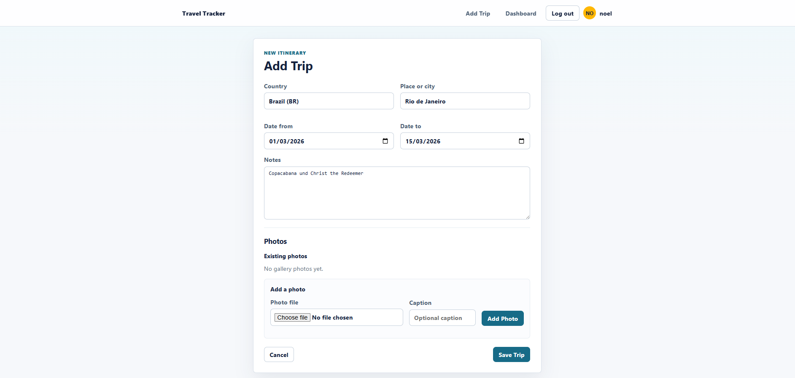
    - Edit-Trip-Formular mit bestehendem Foto sowie neuem Foto im Upload:
      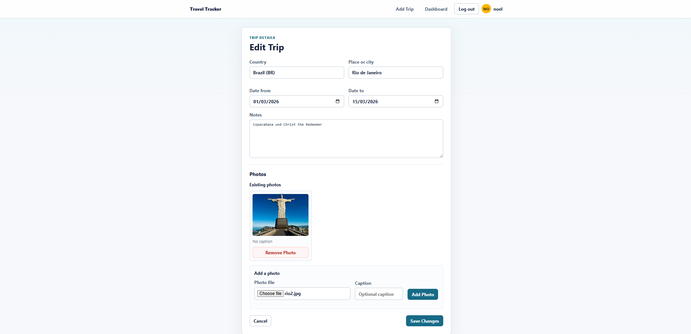
  - **Fotoverwaltung:** Fotos werden im Formular als bestehende Fotos angezeigt. Neue Fotos werden lokal validiert, in Base64 umgewandelt und als Hidden Fields mit dem Trip-Formular gespeichert. Entfernte Fotos können vor dem Speichern wiederhergestellt werden.
    - Sihe Bilder im Add bzw. Edit-Trip-Formular weiter oben.
  - **Galerie und Slideshow:** Die Galerie öffnet als Modal im Dashboard. Ein Klick auf ein Bild startet eine fullscreen Lightbox mit Bildzähler, Caption, `Previous`/`Next` bei mehreren Bildern und `Close`. Die Lightbox unterstützt `Escape`, `ArrowLeft` und `ArrowRight`.
    - Galerie Modal 
      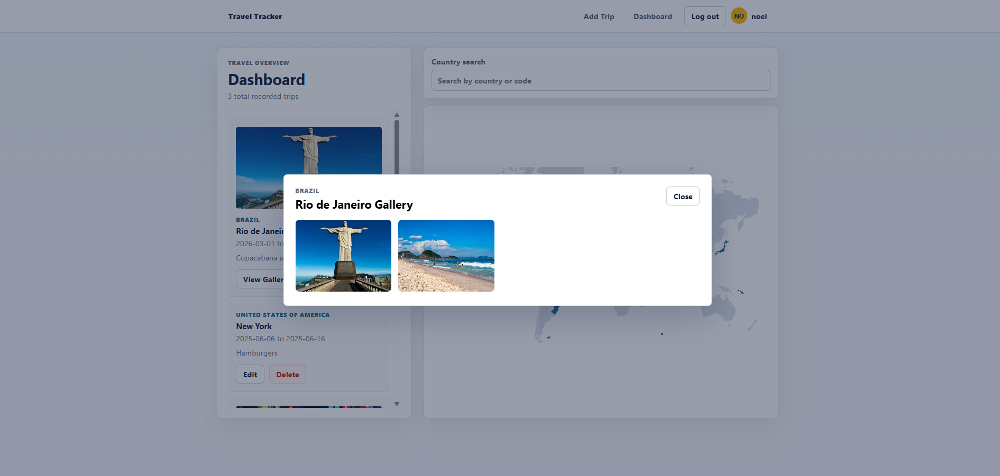
    - Galerie Lightbox
    - 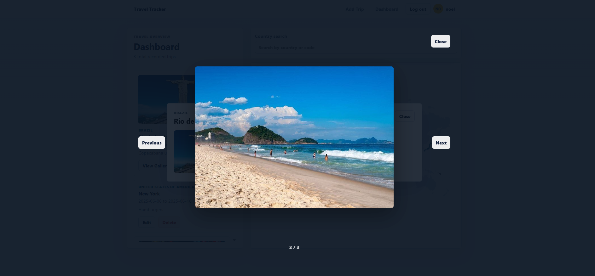
  - **Löschen:** Beim Löschen einer Reise erscheint ein modaler Bestätigungsdialog. Die Reise wird erst nach dem Submit des Dialogformulars serverseitig gelöscht.
    - Delete-Dialog
    - 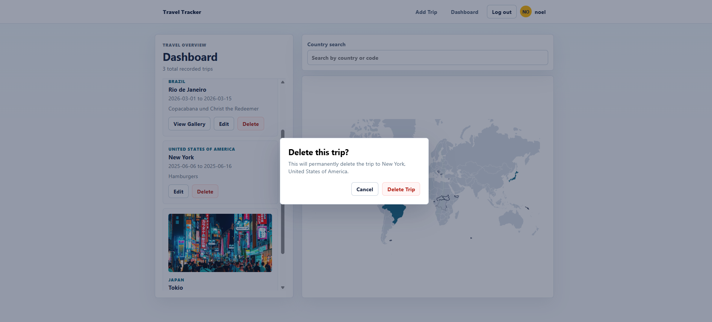

- **Designentscheidungen:**
  - Der Prototyp bleibt bewusst arbeitsorientiert: Dashboard, Karte und Trip-Liste sind direkt sichtbar; es gibt keine Landingpage und keine Marketing-Ansicht.
  - Das Dashboard ist Desktop-first umgesetzt, weil Karte, Suche und Reiseübersicht gleichzeitig sichtbar sein sollen. Für kleinere Viewports bricht das Layout auf eine Spalte um; die Karte steht dann oberhalb der Liste.
  - Die Trip-Liste scrollt innerhalb eines festen Panels. Dadurch bleibt die Weltkarte stabil sichtbar, auch wenn viele Reisen gespeichert sind.
  - Die Karte ist nicht nur Visualisierung, sondern auch Filtersteuerung. So müssen Benutzer nicht zwischen separaten Filterseiten und Kartenansicht wechseln.
  - Der Prototyp verwendet eine reduzierte Farbpalette: dunkles Blau für Text und Primary-Aktionen, Petrol für besuchte Länder/Primary Buttons, Gelb für Auswahl und Avatar, Rot für destruktive Aktionen.
  - Fotos sind direkt in die Trip-Formulare integriert. Dadurch bleibt die Reise das zentrale Objekt; es gibt keine separate Medienverwaltung.
  - Der Delete-Flow ist absichtlich zweistufig, weil Löschen dauerhaft ist und ohne Bestätigung zu leicht versehentlich ausgelöst würde.

#### 3.4.2. Umsetzung (Technik)
Fasst die technische Realisierung zusammen.

- **Technologie-Stack:**
  - **Framework:** Svelte 5 mit SvelteKit 2.
  - **Sprache:** TypeScript.
  - **Build-System:** Vite.
  - **Datenbank:** MongoDB über den offiziellen MongoDB Node Driver.
  - **Authentifizierung:** Benutzername/Passwort, Passwort-Hashing mit `argon2`, serverseitige Sessions mit UUID und HTTP-only Cookie.
  - **Validierung:** `zod` für serverseitige Formularvalidierung; zusätzliche clientseitige Feldvalidierung für Trip-Formulare und Fotoauswahl.
  - **Karte:** `d3-geo` für Projektion/Pfade und `topojson-client` für die Verarbeitung der TopoJSON-Weltkarte.
  - **Länderdaten:** `i18n-iso-countries` für ISO-Alpha-2-Codes und englische Ländernamen, plus Alias-Mapping für Ländernamen aus der Weltkarte.
  - **IDs:** `uuid` für Session-IDs und `crypto.randomUUID()` für neue Foto-IDs im Browser.

- **Tooling:**
  - Entwicklung lokal über `npm run dev` bzw. unter Windows `npm.cmd run dev`.
  - Build-Prüfung über `npm run build` bzw. `npm.cmd run build`.
  - Preview über `npm run preview`.
  - Konfiguration über `.env`; die MongoDB-Verbindung akzeptiert `MONGODB_URI`, `DB_URI` oder `DB_URL` sowie `MONGODB_DB` oder `DB_NAME`.
  - IDE/Editor: Projekt ist lokal als SvelteKit-/TypeScript-Projekt strukturiert; JetBrains-Projektdateien und VS-Code-Empfehlungen sind im Repository vorhanden.
  - KI-Einsatz wird separat in Kapitel **6. KI-Deklaration** beschrieben.

- **Struktur & Komponenten:**
  - `src/routes/+layout.svelte`: App-Shell, Header, Navigation, Benutzeranzeige und globales Styling.
  - `src/routes/+layout.server.ts`: stellt `locals.user` für das Layout bereit.
  - `src/hooks.server.ts`: liest das Session-Cookie, validiert die Session gegen MongoDB und setzt `event.locals.user`.
  - `/login`: `src/routes/login/+page.svelte` und `+page.server.ts`; Login-Formular, Argon2-Verify, Session-Erstellung und Redirect ins Dashboard.
  - `/register`: `src/routes/register/+page.svelte` und `+page.server.ts`; Registrierung, Username-Prüfung, Passwort-Hashing, Session-Erstellung und Redirect.
  - `/dashboard`: `src/routes/dashboard/+page.svelte` und `+page.server.ts`; lädt alle Trips des eingeloggten Benutzers, sortiert nach `dateFrom` und `createdAt`, rendert Dashboard und enthält die Action `deleteTrip`.
  - `/trip/new`: `src/routes/trip/new/+page.svelte` und `+page.server.ts`; lädt optional ein vorausgewähltes Land aus `?country=XX`, erstellt neue Trips und leitet danach zum Dashboard weiter.
  - `/trip/[id]/edit`: `src/routes/trip/[id]/edit/+page.svelte` und `+page.server.ts`; lädt nur Trips des eingeloggten Benutzers, aktualisiert bestehende Trips und liefert 404 bei fremden oder nicht existierenden IDs.
  - `/logout`: `src/routes/logout/+server.ts`; löscht die Session serverseitig und entfernt das Cookie.
  - `/api/uploads/raw`: `src/routes/api/uploads/raw/+server.ts`; geschützter Legacy-Endpunkt zum Ausliefern alter GridFS-Bilder, sofern die Bild-URL zu einem Trip des eingeloggten Benutzers gehört.
  - `WorldMap.svelte`: lädt `countries-110m.json` von jsDelivr, rendert SVG-Länder, markiert besuchte und selektierte Länder und bietet Maus-/Tastaturinteraktion.
  - `CountrySearch.svelte`: Suche im Dashboard mit Trefferliste und Auswahl-Callback.
  - `CountryPicker.svelte`: Länderauswahl in Formularen mit Hidden Field für den ISO-Code und sichtbarem Suchfeld.
  - `TripList.svelte`: scrollbare Trip-Liste, Empty State und optionaler `Record Trip`-Button bei aktivem Länderfilter.
  - `TripCard.svelte`: Darstellung einer einzelnen Reise mit Fotovorschau, Galerie-, Edit- und Delete-Aktion.
  - `PhotoManager.svelte`: Foto-Upload im Formular, lokale Dateivalidierung, Base64-Konvertierung, Hidden Fields, Remove und Undo.
  - `PhotoGrid.svelte`: Galerie-Grid im Dashboard-Modal.
  - `PhotoLightbox.svelte`: fullscreen Slideshow mit Tastatursteuerung.
  - `src/lib/server/trips.ts`: Trip-Validierung, FormData-Mapping, Foto-Normalisierung, CRUD-Funktionen, Public DTO Mapping.
  - `src/lib/server/uploads.ts`: Legacy-GridFS-Upload für das alte `images`-Feld.
  - `src/lib/db/mongo.ts`: MongoDB-Verbindung mit globalem Cache für Development.
  - `src/lib/auth/session.ts`: Session erstellen, laden und löschen.
  - `src/lib/photos.ts`: Foto-Konstanten, Dateivalidierung und Erzeugung der Bildquelle.
  - `src/lib/countries/index.ts`: Länderoptionen, Ländernamen und Mapping von Kartennamen auf ISO-Codes.

- **Daten & Schnittstellen:**
  - **Collections:** `users` speichert Benutzerkonto und Passwort-Hash, `sessions` speichert serverseitige Sessions, `trips` speichert Reisen, `uploads.files`/`uploads.chunks` speichern alte GridFS-Bilder.
  - **Trip-Dokument:**

```ts
interface Trip {
  _id?: ObjectId;
  userId: ObjectId;
  countryCode: string;
  placeName: string;
  dateFrom: string;
  dateTo?: string;
  notes?: string;
  images?: string[];
  photos?: StoredTripPhoto[];
  createdAt?: Date;
  updatedAt?: Date;
}
```

  - **Aktives Foto-Modell im Trip-Dokument:**

```ts
interface TripPhoto {
  id: string;
  filename: string;
  mimeType: string;
  size: number;
  data: string;
  caption?: string;
  uploadedAt: Date;
}
```

  - **Legacy-Foto-Modell:**

```ts
interface LegacyTripPhoto {
  id: string;
  url: string;
  caption?: string;
  uploadedAt: Date;
}
```

  - Das aktive UI nutzt `photos` mit Base64-Daten. Gerendert wird über `data:{mimeType};base64,{data}`.
  - Alte Daten bleiben kompatibel: `images?: string[]` kann weiterhin existieren; `LegacyTripPhoto` mit `legacyUrl` wird beim Public Mapping unterstützt. Die neue UI speichert neue Galerie-Fotos jedoch im `photos`-Array.
  - Alle Trip-Abfragen filtern nach `userId`. Dadurch kann ein Benutzer nur eigene Reisen laden, bearbeiten, löschen und Legacy-Uploads abrufen.
  - Formular-Submit erfolgt über SvelteKit Form Actions. Fehler werden mit `fail(...)` an die Seite zurückgegeben, inklusive Feldfehlern, Formwerten und Foto-Zwischenstand.
  - Die Weltkarte lädt ihre TopoJSON-Daten clientseitig von `https://cdn.jsdelivr.net/npm/world-atlas@2/countries-110m.json`.

- **Validierung:**
  - Registrierung: Benutzername mindestens 3 Zeichen, Passwort mindestens 6 Zeichen, Benutzername muss eindeutig sein.
  - Login: Benutzername und Passwort sind Pflichtfelder; Passwort wird mit `argon2.verify` geprüft.
  - Trip: Land ist ein ISO-Alpha-2-Code, Ort/Stadt ist Pflicht, Startdatum ist Pflicht, Enddatum darf nicht vor dem Startdatum liegen.
  - Fotos: erlaubt sind `image/jpeg`, `image/png` und `image/webp`; maximal 2 MB pro Foto; maximal 10 Fotos pro Reise; Caption maximal 160 Zeichen.
  - Legacy-GridFS-Uploads: maximal 5 Dateien pro Submit, standardmässig maximal 5 MB pro Datei und nur MIME-Typen mit Prefix `image/`.

- **Deployment:**
  - Die Anwendung ist mit `@sveltejs/adapter-auto` für ein kompatibles SvelteKit-Deployment vorbereitet.
  - `netlify.toml` ist vorhanden und nutzt `npm run build`.
  - TODO: Produktions- oder Test-Deployment-URL eintragen, sobald die App separat deployed ist.
  - TODO: Falls Netlify verwendet wird, prüfen, ob das Publish-Verzeichnis für die verwendete SvelteKit-Adapter-Ausgabe korrekt ist.

- **Besondere Entscheidungen:**
  - Sessions werden serverseitig in MongoDB gespeichert und per HTTP-only Cookie referenziert. Das ist für den Prototyp einfacher als OAuth und trotzdem klar vom Frontend getrennt.
  - Fotos werden im aktiven Flow direkt im Trip-Dokument gespeichert. Das reduziert Infrastruktur und vermeidet externes File-Hosting, ist aber wegen Dokumentgrösse und Base64-Overhead nur für kleine Prototyp-Fotos geeignet.
  - Die ältere GridFS-Upload-Logik bleibt im Code, damit vorhandene `images`-Daten und alte Upload-URLs nicht sofort ungültig werden.
  - Die Karte verwendet externe TopoJSON-Daten. Dadurch ist das Repository kleiner, aber die Karte hängt im Browser von Netzwerkzugriff auf jsDelivr ab.
  - Das UI ist bewusst ohne globalen Client Store umgesetzt. Der wichtigste Zustand, z. B. selektiertes Land, Suchquery, Galerie, Lightbox und Löschkandidat, bleibt lokal in der Dashboard-Seite.
  - Nach Create/Update wird per Redirect ins Dashboard gewechselt. Dadurch bleiben Datenstand und URL klar, statt Formularzustand und Dashboard parallel synchronisieren zu müssen.

### 3.5 Validate
- **URL der getesteten Version** (separat deployt)
- **Ziele der Prüfung:** _[welche Fragen sollen beantwortet werden?]_
- **Vorgehen:** _[moderiert/unmoderiert; remote/on-site]_
- **Stichprobe:** _[Mit wem wurde getestet? Profil; Anzahl]_
- **Aufgaben/Szenarien:** _[Ausformulierte Testaufgaben]_
- **Kennzahlen & Beobachtungen:** _[z. B. Erfolgsquote, Zeitbedarf, qualitative Findings]_
- **Zusammenfassung der Resultate:** _[Wichtigste Erkenntnisse; 2-4 Sätze]_
- **Abgeleitete Verbesserungen:** _[Anforderungen, die als nächstes umgesetzt werden sollten, priorisiert, kurz begründet; falls Verbesserungen im Prototyp konkret umgesetzt wurden: In Kap. 4 dokumentieren]_

## 4. Erweiterungen
Dokumentiert Erweiterungen über den Mindestumfang hinaus.
> **Hinweis:** Jede Erweiterung ist separat nach dem folgenden Schema zu beschreiben.

### _[4.x Kurzbeschreibung / Titel]_
- **Beschreibung & Nutzen:** _[Was wurde erweitert? Warum?]_
- **Wo umgesetzt:** _[Wie und wo wurde es gemacht? Frontend, Backend, Datenbank?]_
- **Referenz:** _[Wo wird die Erweiterung auch noch beschrieben, z.B. Screenshot oder Beschreibung in einem anderen Kapitel]_
- **Aus Evaluation abgeleitet?:** _[Wurde diese Erweiterung als Folge eines in der Evaluation identifizierten Issues implementiert?]_

> Das folgende **Beispiel** wurde bewusst kurz gehalten. Erweiterungen dürfen auch ausführlicher beschrieben werden.

### 4.1 Tabelle nach Kategorien filtern
- **Beschreibung & Nutzen:** Tabelle X kann nach Kategorie gefiltert werden, weil User typischerweise nur an einer bestimmten Kategorie interessiert sind.
- **Wo umgesetzt:**
  - **Frontend:** Tabelle mit Dropdown in Datei ...
  - **Backend:** Form Action ... in Datei ...
  - **Datenbank:** MongoDB-Query in Datei ...
- **Referenz:** Screenshot in Kap. x.y
- **Aus Evaluation abgeleitet?:** Ja, Issue x.y

## 5. Projektorganisation

- **Repository & Struktur:**
  - `src/routes`: SvelteKit-Seiten und Server Actions.
  - `src/lib/components`: wiederverwendbare UI-Komponenten.
  - `src/lib/models`: TypeScript-Modelle für MongoDB/Public DTOs.
  - `src/lib/server`: serverseitige Geschäftslogik.
  - `src/lib/db`: MongoDB-Verbindung.
  - `src/lib/styles/global.css`: globales Styling.
- **Lokale Installation:**

```bash
npm install
```

- **Umgebungsvariablen:**

```env
MONGODB_URI=mongodb://127.0.0.1:27017
MONGODB_DB=travel-tracker
COOKIE_NAME=sessionId
SESSION_DAYS=30
```

Alternativ akzeptiert die MongoDB-Verbindung auch `DB_URI`, `DB_URL` oder `DB_NAME`.

- **Entwicklung starten:**

```bash
npm run dev
```

Unter Windows kann auch verwendet werden:

```bash
npm.cmd run dev
```

- **Build prüfen:**

```bash
npm run build
```

Unter Windows:

```bash
npm.cmd run build
```

- **Commit-Praxis:** Die Entwicklung wurde in kleine, beschreibende Commits aufgeteilt, z. B. Feature-, Fix-, Refactor- und Style-Commits.

## 6. KI-Deklaration

Die folgende Deklaration beschreibt den Einsatz von KI im Projekt.

### 6.1 KI-Tools

- **Eingesetzte Tools:** OpenAI ChatGPT/Codex in der Entwicklungsumgebung.
- **Zweck & Umfang:** KI wurde unterstützend eingesetzt für Code-Änderungen, Refactoring, Fehlersuche, Dokumentation, Formulierungen und Build-/Statusprüfungen.
- **Eigene Leistung:** Architekturentscheidungen, fachliche Anforderungen, Bewertung der Vorschläge und finale Abnahme. KI-generierte Änderungen wurden geprüft und über Builds validiert.

### 6.2 Prompt-Vorgehen

Die Prompts wurden auf konkrete Arbeitsschritte ausgerichtet, z. B. "Foto-Upload direkt im Trip-Dokument speichern", "Dashboard-Höhe stabilisieren" oder "README auf Deutsch aktualisieren". Bei technischen Änderungen wurden bestehende Dateien zuerst inspiziert und danach gezielte, kleine Änderungen umgesetzt. Die Resultate wurden jeweils mit `npm.cmd run build` geprüft.

### 6.3 Reflexion

KI war hilfreich, um Implementierungsarbeiten schneller umzusetzen, Bugs systematisch zu analysieren und Dokumentation zu strukturieren bzw. zu formattieren. Grenzen bestehen bei projektspezifischem Kontext, UI-Feinheiten und fachlichen Entscheidungen: Diese müssen weiterhin manuell überprüft werden. Risiken wie veraltete Annahmen, unerwünschte Nebeneffekte oder unpassende Abstraktionen wurden durch Code-Review, gezielte Diffs und Build-Prüfungen reduziert.

## 7. Anhang

- **Wichtige Bibliotheken:**
  - SvelteKit: Webframework.
  - MongoDB: Datenbank.
  - Argon2: Passwort-Hashing.
  - Zod: Validierung.
  - D3 Geo / TopoJSON: Weltkarte.
  - i18n-iso-countries: Länderinformationen.
- **Bekannte technische Hinweise:**
  - Die Weltkarte lädt TopoJSON-Daten zur Laufzeit von jsDelivr.
  - Fotos werden als Base64 direkt im Trip-Dokument gespeichert; dadurch sollte die Dateigrösse bewusst begrenzt bleiben.
  - Der Prototyp enthält noch Kompatibilität für ältere Bildfelder (`images` und Legacy-URL-Fotos), die aktive UI nutzt jedoch die neue Fotoverwaltung.
- **Nützliche Befehle:**

```bash
npm run dev
npm run build
npm run preview
```
